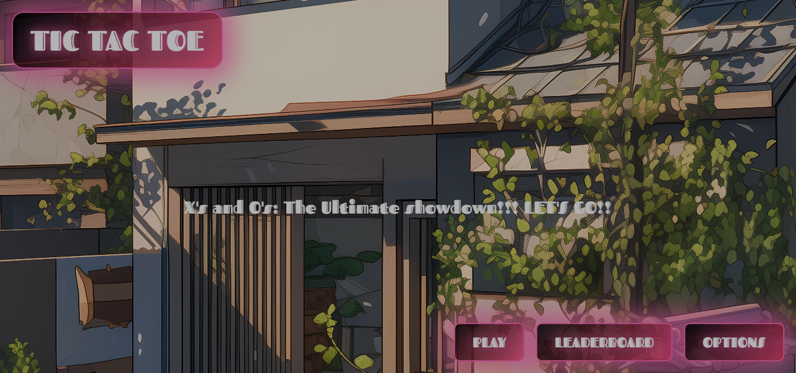
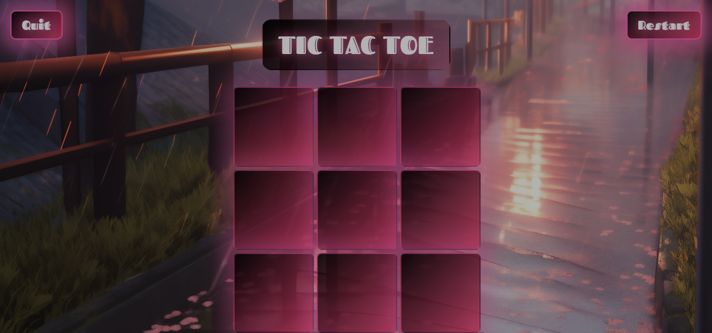

# 🎮 TIC-TAC-TOE: The Ultimate Showdown 🤖 vs 🧠

    
    

    
    

    

TIC-TAC-TOE: The Ultimate Showdown is a web-based version of the classic Tic-Tac-Toe game featuring two-player mode and AI opponent challenges. Track your wins, show off on the leaderboard, and dive into a fun, futuristic experience!
 

This isn’t your average childhood game—oh no, this is TIC-TAC-TOE 2.0, with advanced game mechanics, a leaderboard to flex your victories, and enough back-end power to take you to the moon. 🚀 

Hey who needs friends when you can have AI (I am actually crying typing this lol)

**LinkedIn**: https://www.linkedin.com/in/stephanie-adhiambo-13b75823a/

**Deployed site**: https://stephnereah.github.io/TIC-TAC-TOE/index.html

**Blog Article**: 

INSPIRATION:
---

The reason as to why I choose this particular project, was because I have a strong passion of one day becoming a game developer and I figured why don't I start small. 

As an enthusiast of board games, I made a list of all possible games I could make and my interest landed on the classic Tic Tac Toe
I took this as an opportunity to try create a web based version of it and also show case my love for Japan and futuristic designs, hence why the styling. 

PROJECT OVERVIEW 🎨
---
**THE GAME:**

Remember the days when all you needed was a piece of paper, a pencil, and an opponent? Well, we’ve leveled up. Now it’s just you, a 3x3 grid, and the hope that our algorithm hasn’t already predicted your every move. 😈

But fear not! We believe in you, champion. May the best player win—or at least, may you not rage quit. 🙃

FEATURES 🕹️
---

Two modes: Player vs Player (for when you can convince a friend to battle) or Player vs Algorithm (because who needs friends when you have AI?)

**Dynamic Leaderboard:** 
Track your victories, climb the ranks, and prove that you’re the ultimate Tic-Tac-Toe master.

**User Authentication:**
 Secure login so nobody steals your hard-earned victories (not that we don’t trust your friends… but just in case).

A Friendly (but deadly) Algorithm: Our AI opponent was built with love. And a tiny bit of evil genius. Play at your own risk.

ARCHITECURE 🏛️
---

*Backend:* 
Built with 🐍 Flask  Expect top-notch API handling, smooth game state management, and authentication that even hackers will respect.

*Frontend:* 
Sleek, intuitive, and designed to make you feel like you’re playing a futuristic version of Tic-Tac-Toe.

*Database:* 
Your wins are sacred. That’s why we use a reliable database to store every glorious victory (and the occasional defeat).

DATA MODELLING 🧠
---

We track game states, players, moves, and everything in between. That’s right—nothing gets past us. Not even that sneaky diagonal win you tried to pull.

USER STORIES 📖
---

As a player, I want the ability to reset the game easily and start a new match.

As a user, I want to log in so I can track my win/loss ratio and boast about it later.

As a player, I want the game to display a message when the game ends in a win, loss, or draw.

As a player, I want to play against friends or AI so I can pretend I’m strategizing.

As a competitive human, I want to see my name on the leaderboard so I can screenshot it and send it to my group chat. 😏

HOW TO RUN LOCALLY 🏃‍♂️
---

**CLONE THIS REPOSITORY:**

**bash**

Copy code:
---

git clone https://github.com/your-username/TIC-TAC-TOE.git

cd TIC-TAC-TOE
Install dependencies (because who likes missing libraries?):

**bash**

Copy code:
---

pip install -r requirements.txt

FIRE IT UP:
---

**bash**

Copy code:
---

python manage.py runserver

Visit http://localhost:8000 and prepare to enter the ultimate Tic-Tac-Toe showdown.

TECH STACK 🛠️
---

**Frontend:**
 HTML5, CSS3, JavaScript (because it’s 2024,and vanilla JS still works)

**Backend:**
Flask (we like to keep things exciting)
Database: PostgreSQL (because we care about your stats)

THE TEAM 🧑‍🤝‍🧑
---

Developed by an amazing solo developer and Tic-Tac-Toe enthusiast:

- Stephanie Adhiambo: The mastermind behind our algorithm, backend, and frontend. She ensures the game is both challenging and beautifully presented.

LICENSE 📜
---

This project is licensed under the MIT License. Feel free to use, modify, and distribute the code, but remember to credit back the original author. 
See the [LICENSE](./LICENSE) file for more details.
